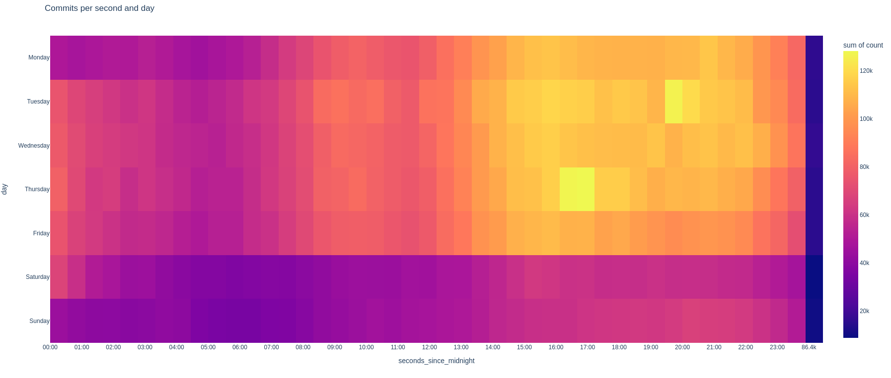

# Data Science in Python - Analysing Github

This repo is my submission for the fist assignment for the master module Data Science in Python at the University College Dublin.
 The assignment was to create a data analysis of the data from a web API. I chose to analyze the data from the Github API.

Specifically I chose to analyze:

- the metadata of every public repository with more than 15 stars
- the metadata of every commit made in these repositories
- the metadata of every user who has contributed to these repositories

In the [notebook](./analysis.ipynb) I focus on the following topics:

- cleaning bogus and irrelevant data to reduce overhead
- converting the freeform string users enter as their location into coordinates
- visualizing repositories over time
- correlating stargazers with repos over time
  - proving a non linear correlation
  - showing how this correlation introduces a bias in the data
- vizualizing the rise and fall of popular programming languages
- analyzing the working hours of contributors
- showing where the most active contributors live
- graphing the collaboration network of contributors

## Some graphs from the analysis

### User Locations

### Popular languages

### Working hours of contributors

### Collaboration network [WIP]

---

It is part of my semester abroad at the University College Dublin.
The rest of my notes, programs and projects created during my studies at the University College Dublin can be found [here](https://github.com/Jo-Eck/Semester_4_UCD).
